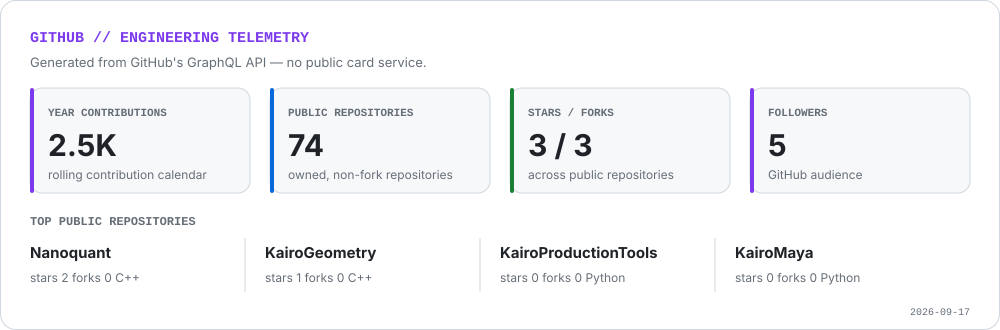
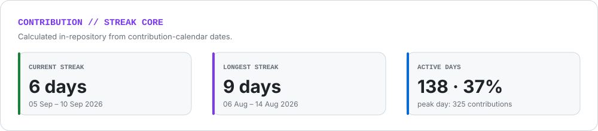
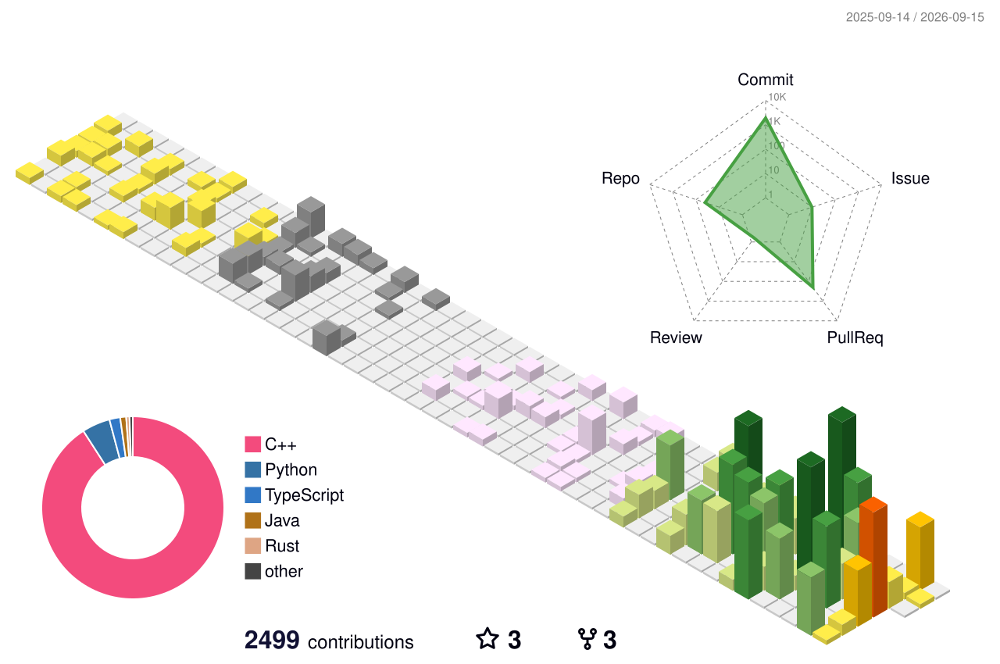

<div align="center">


# Swayam Singal


**Building worlds, writing stories, and shipping systems.**

[](https://yugenkairo.vercel.app)
[](https://www.linkedin.com/in/swayamsdomain)
[](mailto:swayam.singal@gmail.com)
[](https://medium.com/@yugenkairo)

</div>

```text
┌─ swayam@kairo ───────────────────────────────────────────────────────┐
│ role      systems builder / graphics engineer / writer              │
│ current   Kairo engine ecosystem · Vulkan · physics · ray tracing   │
│ stack     C++23 · CMake · Vulkan · Metal · Rust · Python · React    │
│ mode      foundation first, then tools, then worlds                 │
└─────────────────────────────────────────────────────────────────────┘
```

## `whoami`

I am a B.Tech Computer Science graduate building at the boundary of **systems engineering and visual craft**. My work spans C++ engine foundations, rendering, geometry, physics, emulation, AI infrastructure, security tooling, Blender environments, games, research, and long-form writing.

My main engineering direction is **Kairo**: a modular 3D engine ecosystem built upward from mathematics, SIMD, geometry, spatial structures, physics and rendering toward ECS, assets, reflection, an editor, and complete game-runtime tooling.

- **Current focus:** C++23, Vulkan, real-time rendering, engine architecture, ray tracing, and physics.
- **Also building:** AI/security systems, ML infrastructure, desktop tools, and product-grade web applications.
- **Creative practice:** Blender, cinematography, fiction, visual worldbuilding, and philosophical writing.
- **Open to:** graphics, engine, tooling, research-engineering, and selective freelance work.

## `kairo://engine-roadmap`

<table>
<tr>
<td width="50%" valign="top">

### Foundations

- [KairoMath](https://github.com/swayam8624/KairoMath) — vectors, matrices, transforms, quaternions, numerical methods
- [KairoSIMD](https://github.com/swayam8624/KairoSIMD) — data-parallel primitives
- [KairoGeometry](https://github.com/swayam8624/KairoGeometry) — computational geometry foundations
- [KairoSpatial](https://github.com/swayam8624/KairoSpatial) — acceleration and spatial data structures
- [KairoPhysicsMath](https://github.com/swayam8624/KairoPhysicsMath) — math surfaces for simulation

</td>
<td width="50%" valign="top">

### Runtime & Tools

- [KairoPhysicsEngine](https://github.com/swayam8624/KairoPhysicsEngine) — rigid-body simulation work
- [KairoRayTracer](https://github.com/swayam8624/KairoRayTracer) — CPU ray/path tracing experiments
- [KairoRenderer](https://github.com/swayam8624/KairoRenderer) — rendering architecture
- [KairoECS](https://github.com/swayam8624/KairoECS) — entity-component-system layer
- [KairoEditor](https://github.com/swayam8624/KairoEditor) — editor and production tooling

</td>
</tr>
</table>

<div align="center">

[](https://github.com/swayam8624/KairoHub)
[](https://github.com/swayam8624/KairoEngineCore)
[](https://github.com/swayam8624/KairoGameEngine)

</div>

## `featured --systems`

| Project | What it is | Core stack |
|---|---|---|
| **[Sentinel](https://github.com/swayam8624/Sentinel)** | LLM security gateway with PII redaction, prompt sanitization, policy enforcement, provider adapters, and audit trails | Go · Security · LLM infrastructure |
| **[ReliQuary](https://github.com/swayam8624/ReliQuary)** | Content-addressed artifact store for experiment lineage, metadata, and reproducible model retrieval | Rust · ML infrastructure |
| **[BentoML Recreation](https://github.com/swayam8624/bentomlReCreation)** | Inference-serving benchmark focused on throughput, latency, MFU, and power telemetry | Python · GPU inference · MLOps |
| **[SME Finance Hub](https://github.com/swayam8624/sme-finance-hub)** | Finance platform for Indian SMEs with GST, reporting, reconciliation, offline workflows, and local AI | TypeScript · React · Supabase · Tauri |
| **[NES Emulator](https://github.com/swayam8624/NESEmulator)** | 6502 CPU, PPU, memory and controller emulation experiments | C++ · Emulation · Graphics |
| **[Vulkax](https://github.com/swayam8624/Vulkax)** | Vulkan-focused rendering and engine experimentation | C++ · Vulkan · CMake |

## `research && writing`

### Memory Retrieval Cue

**Memory Retrieval Cue: A Framework for Preserving and Enhancing Memory for the Future**  
*Cureus Journal of Computer Science, 2025*

[](https://doi.org/10.7759/s44389-025-03357-2)
[](https://www.cureus.com/articles/22512-memory-retrieval-cue-a-framework-for-preserving-and-enhancing-memory-for-the-future)

EEG-based cognitive-AI research exploring a hybrid CNN + LSTM pipeline for memory-recall prediction.

### The Art of Living the Lie

A long-form philosophical book about identity, denial, discipline, self-deception, and the stories people construct to survive themselves.

## `toolchain`

<div align="center">


<br />


</div>

## `github --telemetry`

The panels below are generated inside this repository from GitHub's API. They do not depend on public statistics-card servers.

### Engineering statistics

<picture>
  <source media="(prefers-color-scheme: dark)" srcset="./assets/profile/github-stats-dark.svg">
  <source media="(prefers-color-scheme: light)" srcset="./assets/profile/github-stats-light.svg">
  
</picture>

### Contribution streak

<picture>
  <source media="(prefers-color-scheme: dark)" srcset="./assets/profile/github-streak-dark.svg">
  <source media="(prefers-color-scheme: light)" srcset="./assets/profile/github-streak-light.svg">
  
</picture>

### Weekly contribution signal

<picture>
  <source media="(prefers-color-scheme: dark)" srcset="./assets/profile/contribution-wave-dark.svg">
  <source media="(prefers-color-scheme: light)" srcset="./assets/profile/contribution-wave-light.svg">
  
</picture>

### Isometric contribution skyline

<picture>
  <source media="(prefers-color-scheme: dark)" srcset="./profile-3d-contrib/profile-night-rainbow.svg">
  <source media="(prefers-color-scheme: light)" srcset="./profile-3d-contrib/profile-season-animate.svg">
  
</picture>

### Contribution Snake

<picture>
  <source media="(prefers-color-scheme: dark)" srcset="./assets/profile/github-contribution-grid-snake-dark.svg">
  <source media="(prefers-color-scheme: light)" srcset="./assets/profile/github-contribution-grid-snake.svg">
  
</picture>

## `creative.output`

Alongside code, I build visual worlds and narrative systems through Blender, photography, cinematography, game design, and fiction. Studies include environment work, industrial props, architecture blockouts, materials, lighting, and visual archives.

```text
engine  → rules of a world
render  → light inside that world
story   → meaning assigned to it
editor  → a way for someone else to build there
```

## `connect()`

<div align="center">

[](mailto:swayam.singal@gmail.com)
[](https://github.com/swayam8624)
[](https://www.linkedin.com/in/swayamsdomain)
[](https://www.researchgate.net/profile/Swayam-Singal?ev=hdr_xprf)

<br />


</div>

<!-- Profile visuals are regenerated daily by .github/workflows/contribution-animations.yml. -->
